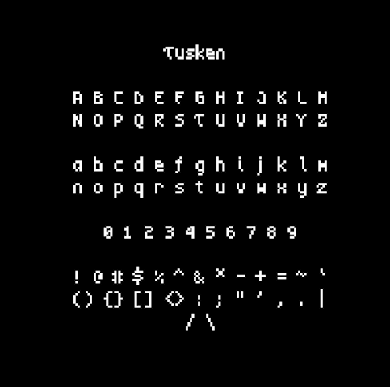
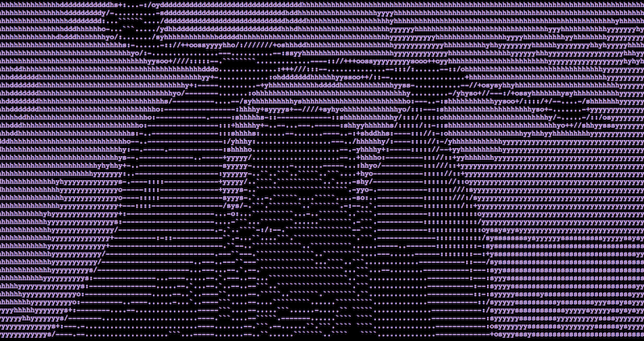

# Tusken: a small, readable bitmap font.

### The Font

Tusken is a small bitmap font that is based off of a modified version of artwiz-aleczapka's "lime" font (artwiz-aleczapka.sourceforge.net). Some of the numerals have been modified, and subtle serifs and other embellishments have been added to the alphabet characters.

 

### Installation

Follow standard procedure for installing .bdf files. MacOS users can readily install the .dfont file for immediate use. 

### License

The original "lime" font is maintained under a GNU Public License V2. This modification is maintained under an MIT License. Either way, feel free to use, distribute, and/or modify this font at your leisure. 

